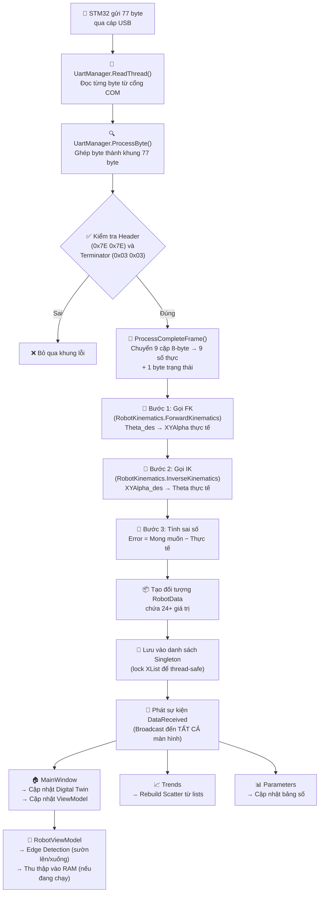
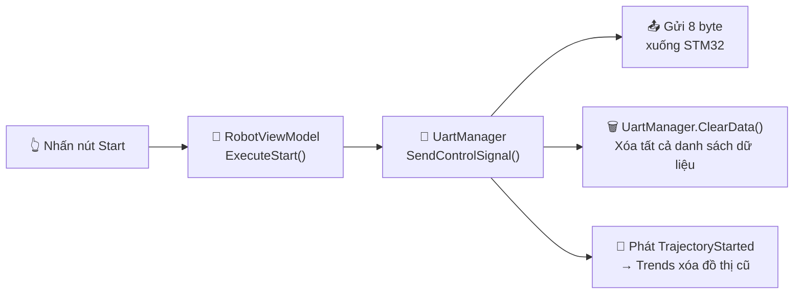
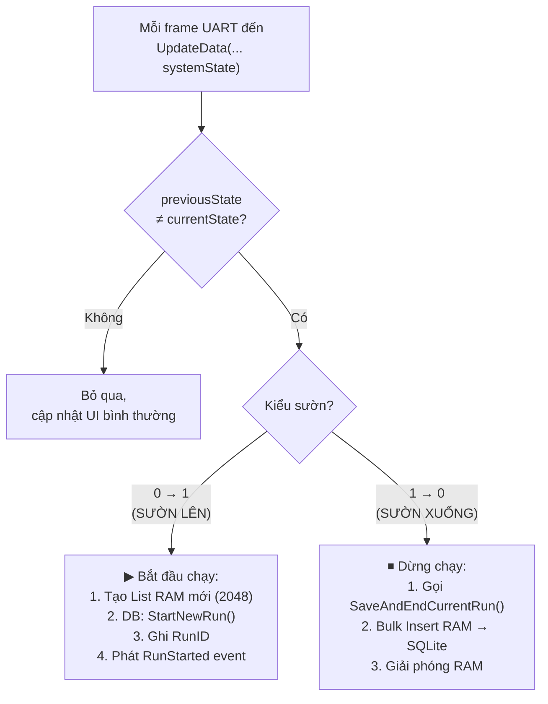
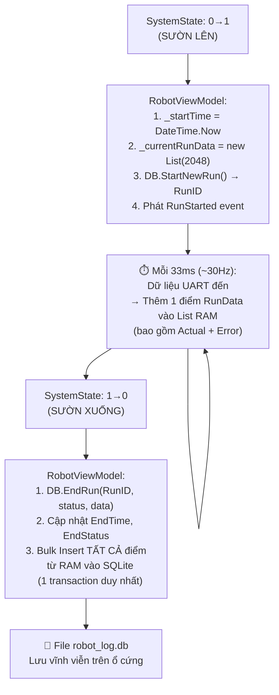
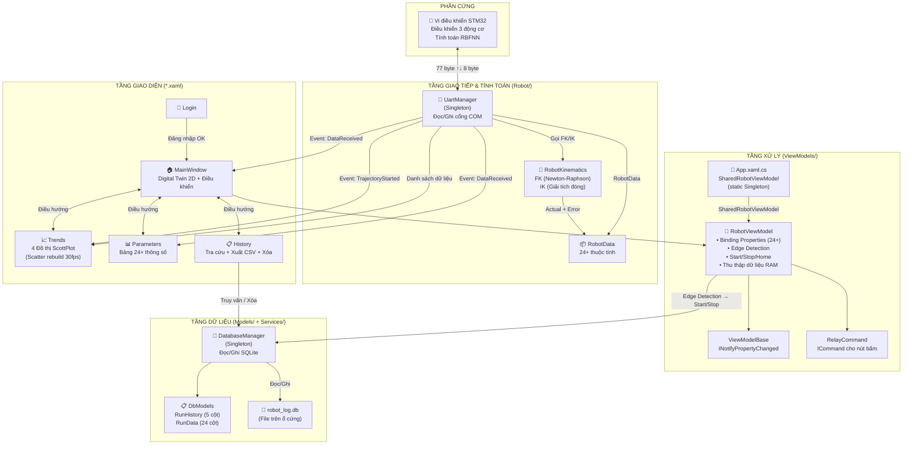

# 📖 TÀI LIỆU KIẾN TRÚC HỆ THỐNG HMI — ROBOT SONG SONG 3RRR

> **Đề tài:** Ứng dụng mạng nơ-ron nhân tạo RBFNN và thiết kế, thi công hệ thống điều khiển giám sát cho Robot song song phẳng 3 bậc tự do
>
> **Trường:** Đại học Bách khoa — Đại học Đà Nẵng · Khoa Điện · Lớp 21TDH2  
> **GVHD:** PGS. TS Lê Tiến Dũng  
> **SVTH:** Phan Hữu Anh Đức (105210311) · Trương Bảo Quang (105210332)


---

## 📑 MỤC LỤC

1. [Tổng quan hệ thống](#1-tổng-quan-hệ-thống)
2. [Cấu trúc thư mục dự án](#2-cấu-trúc-thư-mục-dự-án)
3. [Các màn hình giao diện (5 trang)](#3-các-màn-hình-giao-diện)
4. [Đường đi dữ liệu — Từ phần cứng đến màn hình](#4-đường-đi-dữ-liệu)
5. [Chi tiết từng file và từng biến](#5-chi-tiết-từng-file-và-từng-biến)
6. [Module Động học Robot (RobotKinematics)](#6-module-động-học-robot)
7. [Sơ đồ kiến trúc tổng thể](#7-sơ-đồ-kiến-trúc-tổng-thể)
8. [Bảng tóm tắt tất cả các biến quan trọng](#8-bảng-tóm-tắt-biến)

---

## 1. TỔNG QUAN HỆ THỐNG

### 1.1. Hệ thống gồm 2 phần chính

```
┌─────────────────────┐         Dây cáp USB          ┌─────────────────────┐
│    VI ĐIỀU KHIỂN    │ ◄══════════════════════════► │   MÁY TÍNH (PC)     │
│      STM32          │       (Giao tiếp UART)       │   Phần mềm WPF     │
│                     │                               │                     │
│  • Điều khiển 3     │   Gửi lên: 77 byte dữ liệu  │  • Hiển thị số liệu│
│    động cơ robot    │   (30 lần/giây)               │  • Vẽ đồ thị       │
│  • Tính toán RBFNN  │                               │  • Mô phỏng 2D     │
│  • Đọc cảm biến    │   Gửi xuống: 8 byte lệnh     │  • Tính động học    │
│                     │   (Start/Stop/Home)           │  • Lưu lịch sử     │
└─────────────────────┘                               └─────────────────────┘
```

### 1.2. Luồng hoạt động tổng quát

Hãy tưởng tượng hệ thống như một **đài radio hai chiều**:

1. **STM32 → PC (Uplink):** Vi điều khiển liên tục "phát sóng" ~30 lần mỗi giây, mỗi lần gửi một gói tin **77 byte** chứa thông tin góc khớp, vị trí mong muốn, và momen của robot.
2. **PC: Tính toán Động học:** Phần mềm trên máy tính nhận dữ liệu **mong muốn** từ STM32, sau đó dùng thuật toán **Động học thuận (FK)** và **Động học nghịch (IK)** để tính ra giá trị **thực tế** và **sai số**.
3. **PC → STM32 (Downlink):** Khi người dùng nhấn nút Start/Stop/Home, phần mềm gửi 1 gói tin **8 byte** xuống vi điều khiển để ra lệnh.

### 1.3. Điểm đặc biệt: Sai số KHÔNG đến từ STM32

> ⚠️ **Lưu ý quan trọng:** Khác với nhiều hệ SCADA truyền thống, **sai số (Error) không được gửi từ phần cứng**. Thay vào đó, sai số được **tính toán hoàn toàn trên C#** bằng cách so sánh giá trị mong muốn (từ UART) với giá trị thực tế (từ thuật toán Động học thuận/nghịch).

### 1.4. Ý nghĩa của "WPF"

**WPF** (Windows Presentation Foundation) là công nghệ của Microsoft để xây dựng giao diện đẹp trên Windows. Mỗi trang giao diện gồm 2 file:
- **File `.xaml`** = Bản thiết kế giao diện (giống bản vẽ kiến trúc nhà)
- **File `.xaml.cs`** = Bộ não xử lý (giống thợ điện, nước vận hành căn nhà)

---

## 2. CẤU TRÚC THƯ MỤC DỰ ÁN

```
HMI_WPF/
│
├── HMI_WPF.slnx                 ← File Solution (mở bằng Visual Studio)
├── README.md                     ← Tóm tắt dự án (file bạn đang đọc)
│
├── docs/                         ← 📚 Tài liệu kỹ thuật
│   ├── KIEN_TRUC_DU_AN.md       ← Kiến trúc chi tiết (file này)
│   └── ARCHITECTURE.md          ← Kiến trúc kỹ thuật (tiếng Anh)
│
└── HMI_WPF/                     ← 📂 Mã nguồn chính
    │
    ├── App.xaml + .cs            ← 🚀 Điểm khởi động ứng dụng
    │                                + SharedRobotViewModel (dùng chung toàn app)
    │                                + Khởi tạo Database khi mở phần mềm
    │
    ├── Login.xaml + .cs          ← 🔐 Màn hình ĐĂNG NHẬP
    ├── MainWindow.xaml + .cs     ← 🏠 Màn hình TRANG CHỦ (Digital Twin + Điều khiển)
    ├── Trends.xaml + .cs         ← 📈 Màn hình ĐỒ THỊ (4 biểu đồ thời gian thực)
    ├── Parameters.xaml + .cs     ← 📊 Màn hình THÔNG SỐ (bảng số liệu)
    ├── History.xaml + .cs        ← 📋 Màn hình LỊCH SỬ (tra cứu dữ liệu cũ)
    │
    ├── Robot/                    ← 📡 Thư mục GIAO TIẾP PHẦN CỨNG + TÍNH TOÁN
    │   ├── RobotData.cs          ← Mô hình dữ liệu (hộp đựng 24+ thuộc tính)
    │   ├── UartManager.cs        ← Bộ thu phát tín hiệu (đọc/ghi cổng COM)
    │   └── RobotKinematics.cs    ← Module Động học thuận (FK) + nghịch (IK)
    │
    ├── ViewModels/               ← 🧠 Thư mục BỘ NÃO XỬ LÝ (MVVM)
    │   ├── ViewModelBase.cs      ← Lớp nền tảng chung (INotifyPropertyChanged)
    │   ├── RelayCommand.cs       ← Cơ chế gắn nút bấm với hành động (ICommand)
    │   └── RobotViewModel.cs     ← Bộ não chính: xử lý Start/Stop + Edge Detection + ghi DB
    │
    ├── Models/                   ← 💾 Thư mục CẤU TRÚC CƠ SỞ DỮ LIỆU
    │   └── DbModels.cs           ← Định nghĩa bảng RunHistory và RunData
    │
    ├── Services/                 ← ⚙️ Thư mục DỊCH VỤ
    │   └── DatabaseManager.cs    ← Quản lý đọc/ghi cơ sở dữ liệu SQLite
    │
    └── [Hình ảnh logo]           ← Logo trường ĐH Bách khoa Đà Nẵng + Khoa Điện
```

---

## 3. CÁC MÀN HÌNH GIAO DIỆN

### 3.1. 🔐 Màn hình Đăng nhập (Login)

| Thành phần | Ý nghĩa |
|------------|----------|
| `txtUsername` | Ô nhập tên đăng nhập |
| `txtPassword` | Ô nhập mật khẩu |
| `btnLogin` | Nút đăng nhập |

**Luồng hoạt động:**
```
Người dùng nhập "admin" + "123"
        │
        ▼
    Đúng? ──── Có ────► Mở MainWindow (Trang chủ)
        │
        └──── Sai ────► Hiện thông báo lỗi
```

> **Lưu ý:** Tài khoản được "cứng" (hardcode) trong mã nguồn: `admin / 123`.

---

### 3.2. 🏠 Trang chủ (MainWindow) — Trang quan trọng nhất

Đây là trung tâm điều khiển, gồm 4 khu vực:

#### Khu vực 1: Bảng điều khiển kết nối
| Thành phần | Ý nghĩa |
|------------|----------|
| `cmbPorts` | Dropdown chọn cổng COM (COM3, COM4,...) |
| `cmbBaudrates` | Dropdown chọn tốc độ truyền (115200,...) |
| `btnConnect` | Nút Kết nối / Ngắt kết nối |

> **Lưu ý:** Ứng dụng sẽ tự kết nối `COM3` với baudrate `115200` ngay khi khởi động (`MainWindow` constructor).

#### Khu vực 2: Điều khiển robot
| Thành phần | Ý nghĩa |
|------------|----------|
| ComboBox quỹ đạo | Chọn hình dạng quỹ đạo (9 loại — xem bảng 5.3) |
| `btnStart` | ▶ Bắt đầu chạy robot theo quỹ đạo đã chọn |
| `btnStop` | ⏹ Dừng robot |
| `btnHome` | 🏠 Đưa robot về vị trí gốc |

#### Khu vực 3: Đèn LED trạng thái
| Đèn | Màu | Ý nghĩa |
|------|------|---------|
| `ledRun` | 🟢 Xanh lá | Robot đang chạy (SystemState = 1) |
| `ledStop` | 🔴 Đỏ | Robot đang dừng (SystemState = 0) |
| `ledFault` | 🟡 Vàng (nhấp nháy 5Hz) | Mất kết nối UART > 500ms |

#### Khu vực 4: Digital Twin (Mô phỏng robot 2D)
- Canvas vẽ robot gồm: lưới tọa độ, 3 bệ động cơ, 3 cánh tay chủ động (xanh dương), 3 cánh tay bị động (đỏ cam), 1 mâm tam giác (xanh lá)
- `polyTrace`: Đường nét vẽ quỹ đạo thực tế của robot (tự động xóa khi nhấn Start mới)

---

### 3.3. 📈 Đồ thị (Trends) — 4 biểu đồ thời gian thực

| Biểu đồ | Hiển thị | ComboBox lọc kênh | Thư viện |
|----------|----------|-------------------|----------|
| `plotTrajectory` | Quỹ đạo XY (mong muốn + thực tế) | — | ScottPlot 5 |
| `plotTheta` | Góc khớp (mong muốn + thực tế) theo thời gian | `cboTheta`: Theta1/2/3 | ScottPlot 5 |
| `plotTorque` | Momen động cơ theo thời gian | `cboTorque`: M1/M2/M3/Tất cả | ScottPlot 5 |
| `plotError` | Sai số theo thời gian | `cboError`: eTheta1/2/3/eX/eY | ScottPlot 5 |

**Cơ chế hoạt động:**
- `renderTimer` chạy ở **30 FPS** (mỗi 33ms), mỗi tick **rebuild toàn bộ Scatter** từ danh sách dữ liệu trong `UartManager`
- Đồ thị Theta và Quỹ đạo XY hiển thị **2 đường cùng lúc**: giá trị mong muốn (màu xanh nhạt) và giá trị thực tế (màu hồng/cam)
- Khi robot dừng, dữ liệu KHÔNG bị xóa → đồ thị "đóng băng"
- Khi nhấn Start mới, sự kiện `TrajectoryStarted` xóa tất cả Scatter và dữ liệu cũ

---

### 3.4. 📊 Thông số (Parameters) — Bảng số liệu thời gian thực

Hiển thị tất cả thông số robot dạng bảng số, **phân biệt giữa giá trị mong muốn và thực tế**:

| Nhóm | Biến | Ý nghĩa | Nguồn | Đơn vị |
|------|------|---------|-------|--------|
| Vị trí mong muốn | `ToaDoX`, `ToaDoY` | Tọa độ X/Y mong muốn | UART | m |
| | `GocAlpha` | Góc nghiêng mâm mong muốn | UART | rad |
| Vị trí thực tế | `ActualX`, `ActualY` | Tọa độ X/Y thực tế | FK | m |
| | `ActualAlpha` | Góc nghiêng mâm thực tế | FK | rad |
| Góc khớp MuốnM | `GocTheta1..3` | Góc mong muốn 3 khớp | UART | rad |
| Góc khớp Thực tế | `ActualTheta1..3` | Góc thực tế 3 khớp | IK | rad |
| Momen | `Momen1..3` | Lực xoắn 3 động cơ | UART | N·m |
| Sai số XY | `ErrorX`, `ErrorY`, `ErrorAlpha` | Sai số vị trí | Tính | m/rad |
| Sai số Theta | `ErrorTheta1..3` | Sai số góc khớp | Tính | rad |

---

### 3.5. 📋 Lịch sử (History) — Tra cứu dữ liệu đã chạy

| Thành phần | Ý nghĩa |
|------------|----------|
| `dpFromDate` | Chọn ngày bắt đầu tìm kiếm |
| `dpToDate` | Chọn ngày kết thúc tìm kiếm |
| `cbTrajectory` | Chọn loại quỹ đạo cần xem (Tất cả / Hình Vuông / Chữ DUT,...) |
| `btnSearch` | 🔍 Nút tìm kiếm theo bộ lọc |
| `btnExport` | 📥 Xuất kết quả ra file CSV |
| `btnDelete` | 🗑️ Xóa dữ liệu (xóa theo bộ lọc hoặc xóa tất cả) |
| `HistoryGrid` | Bảng hiển thị kết quả gồm: STT, Tên quỹ đạo, Thời gian bắt đầu/kết thúc, Thời gian chạy, Trạng thái |

**Màu sắc trạng thái:**
- 🟢 `Hoàn thành` — màu xanh lá
- 🟡 `Stop` / `Đã dừng (Từ VĐK)` — màu vàng
- 🔴 `Fault` — màu đỏ

---

## 4. ĐƯỜNG ĐI DỮ LIỆU

### 4.1. Hành trình của 1 gói dữ liệu từ Robot đến Màn hình

Đây là phần **quan trọng nhất** — hãy đọc theo thứ tự từ trên xuống:



### 4.2. Chi tiết cấu trúc khung 77 byte từ STM32

```
Byte:  [0]  [1]  [2..9]   [10..17]  [18..25]  [26..33]  [34..41]  [42..49]
       0x7E 0x7E  Theta1    Theta2    Theta3     PosX      PosY     Alpha
       ──── ──── ──────── ──────── ──────── ──────── ──────── ────────
       Header     ◄────── Mỗi giá trị chiếm 8 byte (kiểu double, Little Endian) ──────►

Byte:  [50..57]  [58..65]  [66..73]  [74]     [75] [76]
       Torque1   Torque2   Torque3   SysState  0x03  0x03
       ──────── ──────── ──────── ─────── ──── ────
                                     1=Run    Terminator
                                     0=Stop
```

**Tổng cộng:** 2 (Header) + 9×8 (9 giá trị double) + 1 (SystemState) + 2 (Terminator) = **77 byte**

> **Giải thích đơn giản:** Giống như một bức thư bưu điện:
> - **Header (0x7E 0x7E)** = Nhãn dán "ĐÂY LÀ THƯ CHÍNH THỨC" (để phân biệt với dữ liệu rác)
> - **9 giá trị double** = Nội dung thư (9 con số, mỗi con số chiếm 8 byte)
> - **SystemState** = Tem đánh dấu "Robot đang chạy hay đang dừng"
> - **Terminator (0x03 0x03)** = Dấu chấm cuối thư (xác nhận thư hoàn chỉnh)

> ⚠️ **Quan trọng:** STM32 chỉ gửi **Theta mong muốn**, **XYAlpha mong muốn**, **Momen**, và **SystemState**. Tất cả giá trị **thực tế** (Actual) và **sai số** (Error) đều được **tính trên C#** bằng module `RobotKinematics`.

### 4.3. Hành trình của lệnh từ Người dùng đến Robot



**Cấu trúc 8 byte lệnh gửi xuống:**
```
[0]   [1]   [2]          [3]     [4]    [5]    [6]   [7]
0x7E  0x7E  TrajectoryID  Start   Stop   Home   0x03  0x03
            (1-9)         (0/1)   (0/1)  (0/1)
```

### 4.4. Cơ chế Edge Detection — Phát hiện sườn lên/xuống

RobotViewModel theo dõi biến `_previousSystemState` để phát hiện sự thay đổi trạng thái:



> **Tại sao dùng Edge Detection thay vì nút bấm?**
> Vì trạng thái Start/Stop **thực sự** được xác nhận bởi **phần cứng STM32** (qua byte SystemState), KHÔNG phải bởi nút bấm trên phần mềm. Nút bấm chỉ gửi lệnh — phần cứng mới là người quyết định chạy hay dừng.

### 4.5. Hành trình ghi dữ liệu vào Cơ sở dữ liệu



> **Tại sao không ghi thẳng vào DB mỗi 33ms?**
> Vì ghi ổ cứng rất chậm (so với RAM). Nếu ghi 30 lần/giây → máy tính sẽ bị giật lag. Giải pháp: Gom hết dữ liệu trong RAM, rồi ghi 1 lần duy nhất khi Stop → **nhanh hơn ~100 lần**.

---

## 5. CHI TIẾT TỪNG FILE VÀ TỪNG BIẾN

### 5.1. 📡 `Robot/UartManager.cs` — Bộ thu phát tín hiệu

**Vai trò:** Giống như một **chiếc radio hai chiều** — vừa nghe (đọc dữ liệu) vừa nói (gửi lệnh), đồng thời **tính toán động học** mỗi khi nhận dữ liệu.

**Mẫu thiết kế Singleton** — Chỉ có đúng **1 bộ thu phát duy nhất** trong toàn bộ ứng dụng. Dù bạn mở trang nào (Trends, Parameters, History), tất cả đều dùng chung 1 kết nối COM. Tránh lỗi "COM port đã bị chiếm".

#### Các biến quan trọng:

| Biến | Kiểu | Ý nghĩa dễ hiểu |
|------|------|--------------------|
| `Instance` | UartManager | "Chiếc radio duy nhất" — truy cập từ mọi nơi bằng `UartManager.Instance` |
| `_serialPort` | SerialPort | Đại diện cho cổng USB/COM đang kết nối |
| `_readThread` | Thread | Luồng nền liên tục đọc byte từ cổng COM (chạy song song với giao diện) |
| `_shouldContinue` | bool (volatile) | Cờ hiệu "có nên tiếp tục đọc không" — đặt `false` khi ngắt kết nối |
| `_currentFrame` | byte[77] | Bộ đệm ghép byte — giống "tấm bảng đang viết dở" |
| `_frameByteIndex` | int | Đang viết đến byte thứ mấy trên tấm bảng |
| `_headerCount` | int | Đã đếm được bao nhiêu byte header (0x7E) liên tiếp |
| `_writeLock` | object | Khóa an toàn khi ghi dữ liệu xuống COM (tránh xung đột đa luồng) |
| `LastReceivedTime` | DateTime | Thời điểm nhận khung hợp lệ cuối cùng — dùng để phát hiện mất kết nối |
| `CurrentTime` | double | Bộ đếm thời gian tích lũy (tăng 0.01 mỗi frame) |
| `HEADER_BYTE` | 0x7E (126) | Giá trị cố định của byte đầu khung |
| `TERMINATOR_BYTE` | 0x03 (3) | Giá trị cố định của byte cuối khung |
| `FRAME_TOTAL_SIZE` | 77 | Tổng chiều dài 1 khung dữ liệu |

#### Các danh sách lưu trữ dữ liệu toàn cục:

| Nhóm | Danh sách | Dữ liệu chứa | Nguồn |
|------|-----------|---------------|-------|
| **Mong muốn** | `XList`, `YList` | Tọa độ X, Y mong muốn | UART |
| | `Theta1List`, `Theta2List`, `Theta3List` | Góc 3 khớp mong muốn | UART |
| | `Torque1List`, `Torque2List`, `Torque3List` | Momen 3 động cơ | UART |
| **Thực tế** | `ActualXList`, `ActualYList`, `ActualAlphaList` | XYAlpha thực tế | FK |
| | `ActualTheta1List`, `ActualTheta2List`, `ActualTheta3List` | Theta thực tế | IK |
| **Sai số** | `ErrorXList`, `ErrorYList`, `ErrorAlphaList` | Sai số vị trí | Tính |
| | `ErrorTheta1List`, `ErrorTheta2List`, `ErrorTheta3List` | Sai số góc | Tính |
| **Chung** | `TimeList` | Nhãn thời gian (giây) | PC |

> **Lưu ý:** `Error1List`, `Error2List`, `Error3List` là **alias** (tên thay thế) trỏ đến `ErrorTheta1List`, `ErrorTheta2List`, `ErrorTheta3List` để tương thích với code cũ.

#### Các sự kiện (Event) — Cơ chế "phát sóng":

| Sự kiện | Khi nào phát | Ai nghe |
|---------|-------------|---------|
| `DataReceived` | Mỗi khi nhận được 1 khung 77 byte hợp lệ (sau khi tính FK/IK) | MainWindow, Trends, Parameters |
| `StatusChanged` | Khi kết nối/ngắt/lỗi | (Dành cho debug) |
| `TrajectoryStarted` | Khi gửi lệnh Start (để xóa đồ thị cũ + xóa danh sách) | Trends |

#### Phương thức `ProcessCompleteFrame()` — Trái tim của hệ thống:

Đây là hàm được gọi mỗi khi nhận đủ 77 byte hợp lệ. Nó thực hiện **3 bước tính toán** quan trọng:

```
Bước 1: Parse 9 giá trị double từ UART
    → Theta1/2/3, PosX/Y, Alpha, Torque1/2/3, SystemState

Bước 2: Gọi FK (Theta_des → XYAlpha_actual)
    → Tính ActualX, ActualY, ActualAlpha

Bước 3: Gọi IK (XYAlpha_des → Theta_actual)
    → Tính ActualTheta1, ActualTheta2, ActualTheta3

Bước 4: Tính sai số
    → ErrorX/Y/Alpha = Desired − Actual (FK)
    → ErrorTheta1/2/3 = Desired − Actual (IK)

Bước 5: Lưu tất cả vào danh sách (lock-protected)
Bước 6: Phát DataReceived event
```

---

### 5.2. 📦 `Robot/RobotData.cs` — Mô hình dữ liệu

**Vai trò:** Giống một **cái hộp có 24+ ngăn** — mỗi ngăn chứa 1 thông số của robot. Hộp này được **truyền** đi khắp ứng dụng thông qua sự kiện `DataReceived`.

| Nhóm | Thuộc tính | Kiểu | Ý nghĩa | Nguồn |
|------|-----------|------|---------|-------|
| **UART** | `Theta1`, `Theta2`, `Theta3` | double | Góc mong muốn 3 khớp (rad) | UART byte [2..25] |
| | `PosX`, `PosY` | double | Tọa độ mong muốn (m) | UART byte [26..41] |
| | `Alpha` | double | Góc nghiêng mong muốn (rad) | UART byte [42..49] |
| | `Torque1`, `Torque2`, `Torque3` | double | Momen xoắn (N·m) | UART byte [50..73] |
| | `SystemState` | byte | 1 = Đang chạy, 0 = Đang dừng | UART byte [74] |
| | `ReceivedTime` | DateTime | Thời điểm PC nhận frame | Tự gán bởi PC |
| **FK** | `ActualX`, `ActualY`, `ActualAlpha` | double | XYAlpha thực tế từ FK | Tính |
| **IK** | `ActualTheta1`, `ActualTheta2`, `ActualTheta3` | double | Theta thực tế từ IK | Tính |
| **Sai số** | `ErrorX`, `ErrorY`, `ErrorAlpha` | double | Sai số vị trí | Tính |
| | `ErrorTheta1`, `ErrorTheta2`, `ErrorTheta3` | double | Sai số góc | Tính |

**Alias tương thích:** `Error1` → `ErrorTheta1`, `Error2` → `ErrorTheta2`, `Error3` → `ErrorTheta3`

**`RobotDataEventArgs`** — Lớp bao bọc:
> Giống một **phong bì** bọc quanh hộp `RobotData` để có thể gửi qua hệ thống sự kiện (Event) của C#. Các trang UI nhận phong bì → mở ra → lấy hộp `Data` bên trong.

---

### 5.3. 🧠 `ViewModels/RobotViewModel.cs` — Bộ não trung tâm

**Vai trò:** Là **cầu nối** giữa giao diện người dùng và phần cứng. Xử lý logic khi nhấn nút, cập nhật số liệu hiển thị, phát hiện sườn trạng thái, và ghi log vào database.

**Đặc biệt:** `RobotViewModel` là một **Singleton RobotViewModel** được tạo duy nhất 1 lần trong `App.xaml.cs` và **chia sẻ** giữa **tất cả các cửa sổ** thông qua `App.SharedRobotViewModel`. Điều này đảm bảo Edge Detection hoạt động nhất quán khi người dùng chuyển trang.

#### Các biến hiển thị (Binding Properties) — Mong muốn:

| Biến nội bộ | Property công khai | Ý nghĩa | Nguồn |
|-------------|-------------------|---------|-------|
| `_toaDoX` | `ToaDoX` | Tọa độ X mong muốn | UART |
| `_toaDoY` | `ToaDoY` | Tọa độ Y mong muốn | UART |
| `_gocAlpha` | `GocAlpha` | Góc Alpha mong muốn | UART |
| `_gocTheta1..3` | `GocTheta1..3` | Góc 3 khớp mong muốn | UART |
| `_momen1..3` | `Momen1..3` | Momen 3 động cơ | UART |

#### Các biến hiển thị — Thực tế & Sai số:

| Property | Ý nghĩa | Nguồn |
|----------|---------|-------|
| `ActualX`, `ActualY`, `ActualAlpha` | XYAlpha thực tế | FK |
| `ActualTheta1..3` | Theta thực tế | IK |
| `ErrorX`, `ErrorY`, `ErrorAlpha` | Sai số vị trí | Tính |
| `ErrorTheta1..3` | Sai số góc | Tính |

#### Các biến khác:

| Biến | Ý nghĩa |
|------|---------|
| `_trangThaiHeThong` | Chuỗi trạng thái ("Đang chạy", "Chưa kết nối",...) |
| `_selectedTrajectoryId` | ID quỹ đạo đã chọn trong ComboBox (mặc định "2" = Hình Tròn) |
| `_systemState` | Trạng thái hệ thống hiện tại (0/1) |
| `_previousSystemState` | Trạng thái hệ thống **frame trước** — dùng cho Edge Detection |

#### Các biến ghi log Database:

| Biến | Ý nghĩa |
|------|---------|
| `_currentRunId` | ID của lần chạy hiện tại trong DB. Bằng -1 nghĩa là "chưa chạy" |
| `_currentRunData` | Danh sách tạm trong RAM — chứa tất cả điểm dữ liệu thu được trong lần chạy này (pre-allocated 2048) |
| `_startTime` | Thời điểm sườn lên — dùng để tính `TimeOffset` (đã chạy được bao lâu) |

#### Các lệnh (Commands) — Khi nhấn nút:

| Lệnh | Hàm xử lý | Hành động |
|-------|-----------|----------|
| `StartCommand` | `ExecuteStart()` | Gửi `SendControlSignal(trajId, start=true, ...)` xuống STM32 → UartManager tự ClearData + phát TrajectoryStarted |
| `StopCommand` | `ExecuteStop()` | Gửi `SendControlSignal(trajId, stop=true, ...)` xuống STM32 |
| `HomeCommand` | `ExecuteHome()` | Gửi `SendControlSignal(trajId, home=true, ...)` xuống STM32 |

> **Lưu ý:** Ghi dữ liệu DB không được kích hoạt bởi nút bấm, mà bởi **Edge Detection** trong `UpdateData()`.

#### Sự kiện:

| Sự kiện | Khi nào phát |
|---------|-------------|
| `RunStarted` | Khi phát hiện sườn lên (0→1) — thông báo cho UI rằng một lần chạy mới đã bắt đầu |

#### Bảng ánh xạ ID quỹ đạo → Tên:

| ID | Tên quỹ đạo |
|----|-------------|
| 1 | Hình Vuông |
| 2 | Hình Tròn |
| 3 | Đường Thẳng |
| 4 | Hình Sao |
| 5 | Hình Hạc |
| 6 | Vẽ Chữ A |
| 7 | Vẽ Chữ B |
| 8 | Vẽ Chữ DUT |
| 9 | Vẽ Chữ TDH |

#### Phương thức `UpdateDataFromRobotData()`:

Đây là phương thức overload đầy đủ nhận trực tiếp đối tượng `RobotData`, cập nhật toàn bộ thuộc tính Actual/Error từ kết quả kinematics, đồng thời **bổ sung** giá trị thực tế vào điểm dữ liệu cuối trong `_currentRunData` (vì ban đầu `UpdateData()` chỉ ghi giá trị mong muốn).

---

### 5.4. `ViewModels/ViewModelBase.cs` — Nền tảng ViewModel

**Vai trò:** Giống **hệ thống thần kinh** — khi một giá trị thay đổi bên trong, nó tự động "báo" cho giao diện cập nhật lại.

| Thành phần | Mục đích |
|-----------|---------|
| `INotifyPropertyChanged` | Giao diện (interface) bắt buộc để WPF biết khi nào dữ liệu đổi |
| `OnPropertyChanged()` | Phát tín hiệu "thuộc tính X đã thay đổi" |
| `SetProperty()` | Gán giá trị mới cho biến + tự động phát tín hiệu. Chỉ phát khi giá trị thực sự đổi (tối ưu) |

---

### 5.5. `ViewModels/RelayCommand.cs` — Cầu nối nút bấm

**Vai trò:** Cho phép gắn hàm xử lý C# trực tiếp vào nút bấm trong XAML, **không cần viết sự kiện Click** trong code-behind.

> **Ví dụ dễ hiểu:** Thay vì phải viết `btnStart.Click += ...` trong code-behind, ta chỉ cần khai báo trong XAML: `Command="{Binding StartCommand}"` → WPF tự biết khi nào nhấn nút thì gọi hàm nào.

---

### 5.6. 💾 `Models/DbModels.cs` — Cấu trúc Cơ sở dữ liệu

#### Bảng `RunHistory` — Lưu thông tin tổng quan mỗi lần chạy

| Cột | Kiểu | Ý nghĩa | Ví dụ |
|-----|------|---------|-------|
| `RunID` | int (tự tăng) | Số thứ tự lần chạy | 1, 2, 3,... |
| `TrajName` | string | Tên quỹ đạo đã chọn | "Hình Vuông", "Vẽ Chữ DUT" |
| `StartTime` | DateTime (ISO 8601) | Thời điểm sườn lên | 2026-04-15T09:30:00.000 |
| `EndTime` | DateTime (ISO 8601) | Thời điểm sườn xuống | 2026-04-15T09:31:25.000 |
| `EndStatus` | string | Trạng thái kết thúc | "Hoàn thành" / "Đã dừng (Từ VĐK)" / "Fault" |
| `EndTimeDisplay` | string *(tính toán)* | EndTime đã format đẹp | "15/04/2026 09:31:25" hoặc "Đang chạy..." |
| `DurationDisplay` | string *(tính toán)* | Thời gian chạy | "01:25" |

#### Bảng `RunData` — Lưu từng điểm dữ liệu chi tiết

| Cột | Kiểu | Nguồn | Ý nghĩa |
|-----|------|-------|---------|
| `DataID` | int (tự tăng) | — | Số thứ tự điểm dữ liệu |
| `RunID` | int (khóa ngoại) | — | Thuộc lần chạy nào |
| `TimeOffset` | double | PC | Giây tính từ lúc Start. VD: 0.0, 0.033, 0.066,... |
| `Target_X`, `Target_Y` | double | UART | Tọa độ mong muốn (m) |
| `Alpha` | double | UART | Góc nghiêng mong muốn (rad) |
| `X`, `Y` | double | FK | Tọa độ thực tế (m) |
| `ActualAlpha` | double | FK | Góc nghiêng thực tế (rad) |
| `Theta1..3` | double | UART | Góc 3 khớp mong muốn (rad) |
| `ActualTheta1..3` | double | IK | Góc 3 khớp thực tế (rad) |
| `Torque1..3` | double | UART | Momen 3 động cơ (N·m) |
| `ErrorX`, `ErrorY`, `ErrorAlpha` | double | Tính | Sai số vị trí (m/rad) |
| `Error1..3` | double | Tính | Sai số góc (rad) — ErrorTheta1/2/3 |

> **Mối quan hệ giữa 2 bảng:** Mỗi dòng trong RunHistory có thể có hàng nghìn dòng RunData tương ứng (30 điểm/giây × 60 giây = 1800 điểm cho 1 lần chạy 1 phút).

---

### 5.7. ⚙️ `Services/DatabaseManager.cs` — Quản lý Cơ sở dữ liệu

**Vai trò:** Giống **nhân viên thư viện** — chỉ có 1 người duy nhất (Singleton), phụ trách tất cả việc đọc/ghi sách (dữ liệu) vào kho (SQLite).

#### Các phương thức:

| Phương thức | Khi nào gọi | Làm gì |
|-------------|------------|--------|
| `InitializeDatabase()` | App khởi động | Tạo 2 bảng RunHistory + RunData nếu chưa có + Migration cột mới |
| `StartNewRun(trajName)` | Edge Detection phát hiện sườn lên | Chèn 1 dòng mới vào RunHistory, trả về RunID |
| `EndRun(runId, status, data)` | Edge Detection phát hiện sườn xuống / Fault | 1. Cập nhật EndTime + EndStatus<br>2. Ghi toàn bộ data vào RunData (1 transaction) |
| `GetAllRunHistory()` | Mở trang History | Đọc tất cả lần chạy, sắp xếp mới nhất lên đầu |
| `GetFilteredRunHistory(from, to, traj)` | Nhấn Tìm kiếm | Đọc lần chạy theo bộ lọc ngày + quỹ đạo |
| `GetRunDataByRunID(runId)` | Chọn 1 lần chạy cụ thể | Đọc toàn bộ điểm dữ liệu (24 cột) của lần chạy đó |
| `DeleteAllRuns()` | Nhấn Xóa tất cả | Xóa toàn bộ RunData + RunHistory + reset autoincrement |
| `DeleteFilteredRuns(from, to, traj)` | Nhấn Xóa theo bộ lọc | Xóa dữ liệu theo ngày + quỹ đạo |

#### Biến quan trọng:

| Biến | Ý nghĩa |
|------|---------|
| `_connectionString` | Đường dẫn đến file `robot_log.db` (nằm cạnh file .exe) |

#### Migration an toàn:

DatabaseManager có phương thức `AddColumnIfMissing()` — khi ứng dụng được nâng cấp, nó tự thêm cột mới (Actual*, Error*) vào bảng RunData cũ mà **không xóa dữ liệu cũ**.

---

### 5.8. `App.xaml.cs` — Điểm khởi động

```
Ứng dụng khởi chạy
        │
        ▼
  OnStartup() được gọi
        │
        ├── SharedRobotViewModel = new RobotViewModel()  ← Tạo 1 lần duy nhất
        │
        └── DatabaseManager.Instance.InitializeDatabase()
            → Tạo file robot_log.db nếu chưa có
            → Tạo/cập nhật 2 bảng RunHistory + RunData
        │
        ▼
  Mở cửa sổ Login.xaml (theo cấu hình trong App.xaml: StartupUri)
```

> **SharedRobotViewModel** — Instance duy nhất của `RobotViewModel` được khai báo là `static` property. Tất cả cửa sổ (MainWindow, Trends...) đều sử dụng chung instance này để đảm bảo Edge Detection (`_previousSystemState`) hoạt động nhất quán khi người dùng chuyển trang.

---

### 5.9. `MainWindow.xaml.cs` — Code-behind Trang chủ

#### Các biến Digital Twin (Mô phỏng robot):

| Biến | Ý nghĩa |
|------|---------|
| `activeArms[3]` | 3 đường Line vẽ cánh tay chủ động (màu DodgerBlue, dày 8px) |
| `passiveArms[3]` | 3 đường Line vẽ cánh tay bị động (màu Tomato, dày 4px) |
| `movingPlatform` | Hình đa giác vẽ mâm tam giác (màu LimeGreen, bán trong suốt) |
| `motorBase[3]` | 3 hình tròn vẽ bệ động cơ cố định (24×24px, viền trắng) |
| `M[3]` | Tọa độ 3 bệ động cơ: M1=(0, 0), M2=(0.5, 0), M3=(0.25, 0.433) |
| `gamma[3]` | Góc cố định 3 chốt bám trên mâm: 210°, 330°, 90° |
| `L1` | Chiều dài cánh tay chủ động = 0.20 m |
| `L2` | Chiều dài cánh tay bị động = 0.20 m |
| `L3` | Bán kính nội tiếp mâm = 0.125/√3 m |
| `SCALE` | Tỉ lệ 1 mét = 850 pixel |
| `OFFSET_X`, `OFFSET_Y` | Điểm gốc tọa độ trên Canvas (170px, 680px) |

#### Các biến trạng thái LED:

| Biến | Ý nghĩa |
|------|---------|
| `_isUartFault` | `true` = mất kết nối UART > 500ms |
| `_isFaultLedYellow` | Biến nhấp nháy đèn Fault (bật/tắt xen kẽ mỗi 100ms) |
| `_currentSystemState` | 0 = Stop, 1 = Run (nhận từ byte thứ 74 của khung UART) |

#### Tự động kết nối:

MainWindow tự gọi `UartManager.Instance.Start("COM3", 115200)` trong constructor — nghĩa là ứng dụng sẽ **tự kết nối** COM3 ngay khi khởi động mà không cần nhấn nút.

#### Cơ chế điều hướng trang:

Mỗi nút điều hướng (Trends, Parameters, History) tạo **cửa sổ mới** tại cùng vị trí rồi **đóng cửa sổ cũ**. Kết nối UART không bị ảnh hưởng vì `UartManager` là Singleton.

---

### 5.10. `Trends.xaml.cs` — Code-behind Đồ thị

#### Cơ chế hoạt động:

Khác với DataLogger (chỉ thêm điểm), Trends sử dụng **Scatter rebuild** — mỗi 33ms (30 FPS):
1. Xóa tất cả Scatter cũ khỏi Plot
2. Copy danh sách dữ liệu từ `UartManager` (trong `lock`)
3. Tạo Scatter mới từ mảng đã copy
4. AutoScale trục + Refresh tất cả 4 đồ thị

#### Các biến:

| Biến | Đồ thị | Ý nghĩa |
|------|--------|---------|
| `thetaDesScatter` | plotTheta | Scatter Theta mong muốn (màu #4FC3F7 — xanh nhạt) |
| `thetaActScatter` | plotTheta | Scatter Theta thực tế (màu #EF9A9A — hồng nhạt) |
| `torque1/2/3Scatter` | plotTorque | Scatter Momen (đỏ/xanh/xanh dương) |
| `errorScatter` | plotError | Scatter Sai số (màu #FFD54F — vàng) |
| `trajDesScatter` | plotTrajectory | Scatter quỹ đạo XY mong muốn (Cyan) |
| `trajActScatter` | plotTrajectory | Scatter quỹ đạo XY thực tế (Orange) |
| `_thetaChannel` | — | Kênh Theta đang chọn: 0=T1, 1=T2, 2=T3 |
| `_torqueChannel` | — | Kênh Momen đang chọn: 0=M1, 1=M2, 2=M3, 3=Tất cả |
| `_errorChannel` | — | Kênh Sai số đang chọn: 0=eTheta1, 1=eTheta2, 2=eTheta3, 3=eX, 4=eY |
| `renderTimer` | — | DispatcherTimer 30 FPS (33ms) |

---

## 6. MODULE ĐỘNG HỌC ROBOT

### 6.1. 🔬 `Robot/RobotKinematics.cs` — Bộ tính toán Động học

**Vai trò:** Module tính toán hoàn toàn **thuần số học** — không phụ thuộc giao diện hay UART. Nhận đầu vào là các góc/tọa độ, trả về kết quả tính toán.

**Thuật toán được dịch trực tiếp từ mã MATLAB** của đề tài, đảm bảo kết quả trùng khớp với mô phỏng gốc.

#### Thông số hình học cố định:

| Ký hiệu | Giá trị | Ý nghĩa |
|---------|---------|---------|
| `L1` | 0.20 m | Chiều dài cánh tay chủ động |
| `L2` | 0.20 m | Chiều dài cánh tay bị động |
| `L3` | 0.125 / √3 ≈ 0.0722 m | Bán kính nội tiếp mâm di động |
| `Xo[3]` | {0.0, 0.5, 0.25} | Tọa độ X gốc 3 động cơ |
| `Yo[3]` | {0.0, 0.0, 0.433} | Tọa độ Y gốc 3 động cơ |
| `Gamma[3]` | {π/6, 5π/6, 3π/2} | Góc offset 3 chốt mâm di động |

#### Động học Nghịch (IK) — `InverseKinematics()`:

```
Đầu vào:  (x, y, alpha) — vị trí & hướng mâm di động MONG MUỐN
Đầu ra:   (theta1, theta2, theta3) — góc khớp THỰC TẾ

Thuật toán: Giải tích đóng (closed-form)
  Cho mỗi khớp i = 1, 2, 3:
    1. Tính tọa độ chốt bám: (xc, yc) = pos + L3·cos/sin(phi) - O[i]
    2. Tính góc si = atan2(yc, xc)
    3. Tính beta = acos(...)  (clamp [-1,1] để tránh lỗi số)
    4. theta[i] = si + beta
```

#### Động học Thuận (FK) — `ForwardKinematics()`:

```
Đầu vào:  (theta1, theta2, theta3) — góc khớp MONG MUỐN từ UART
          (x0, y0, alpha0) — initial guess (= XYAlpha mong muốn)
Đầu ra:   (actualX, actualY, actualAlpha) — vị trí THỰC TẾ

Thuật toán: Newton-Raphson lặp (tối đa 300 vòng, sai số < 1e-12)
  1. Tính hệ phương trình F(p) = 0 (3 ràng buộc hình học)
  2. Tính Jacobian J(p) 3×3
  3. Giải hệ tuyến tính J·δ = F (Gaussian elimination có pivot)
  4. Cập nhật p = p - δ
  5. Kiểm tra hội tụ: |δ| < ε → dừng
```

#### Các hàm hỗ trợ:

| Hàm | Mục đích |
|-----|---------|
| `EvalF()` | Tính hệ 3 phương trình ràng buộc hình học F(p) |
| `EvalJF()` | Tính ma trận Jacobian 3×3 |
| `SolveLinear3x3()` | Giải hệ tuyến tính Ax=b bằng Gaussian elimination có partial pivoting |
| `Norm3()` | Tính norm Euclid 3D |

---

## 7. SƠ ĐỒ KIẾN TRÚC TỔNG THỂ



---

## 8. BẢNG TÓM TẮT BIẾN

### 8.1. Tất cả 9 biến dữ liệu từ UART (STM32 → PC)

| # | Tên biến | Ý nghĩa tiếng Việt | Đơn vị | Byte trong khung |
|---|---------|---------------------|--------|-----------------|
| 1 | `Theta1` | Góc mong muốn động cơ 1 | radian | [2..9] |
| 2 | `Theta2` | Góc mong muốn động cơ 2 | radian | [10..17] |
| 3 | `Theta3` | Góc mong muốn động cơ 3 | radian | [18..25] |
| 4 | `PosX` | Tọa độ X mong muốn đầu tác động | mét | [26..33] |
| 5 | `PosY` | Tọa độ Y mong muốn đầu tác động | mét | [34..41] |
| 6 | `Alpha` | Góc nghiêng mâm mong muốn | radian | [42..49] |
| 7 | `Torque1` | Momen xoắn động cơ 1 | N·m | [50..57] |
| 8 | `Torque2` | Momen xoắn động cơ 2 | N·m | [58..65] |
| 9 | `Torque3` | Momen xoắn động cơ 3 | N·m | [66..73] |

### 8.2. Các biến tính toán trên C# (không có trong UART)

| # | Tên biến | Ý nghĩa | Thuật toán | Đơn vị |
|---|---------|---------|-----------|--------|
| 10 | `ActualX` | Tọa độ X thực tế | FK (Newton-Raphson) | mét |
| 11 | `ActualY` | Tọa độ Y thực tế | FK | mét |
| 12 | `ActualAlpha` | Góc nghiêng thực tế | FK | radian |
| 13 | `ActualTheta1` | Góc thực tế khớp 1 | IK (giải tích đóng) | radian |
| 14 | `ActualTheta2` | Góc thực tế khớp 2 | IK | radian |
| 15 | `ActualTheta3` | Góc thực tế khớp 3 | IK | radian |
| 16 | `ErrorX` | Sai số X = PosX − ActualX | Phép trừ | mét |
| 17 | `ErrorY` | Sai số Y = PosY − ActualY | Phép trừ | mét |
| 18 | `ErrorAlpha` | Sai số Alpha | Phép trừ | radian |
| 19 | `ErrorTheta1` | Sai số Theta 1 | Phép trừ | radian |
| 20 | `ErrorTheta2` | Sai số Theta 2 | Phép trừ | radian |
| 21 | `ErrorTheta3` | Sai số Theta 3 | Phép trừ | radian |

### 8.3. Các hằng số quan trọng

| Hằng số | Giá trị | Ý nghĩa |
|---------|---------|---------|
| `HEADER_BYTE` | 0x7E (126) | Byte đánh dấu đầu khung |
| `TERMINATOR_BYTE` | 0x03 (3) | Byte đánh dấu cuối khung |
| `FRAME_TOTAL_SIZE` | 77 | Tổng chiều dài 1 khung (byte) |
| `L1` | 0.20 m | Chiều dài cánh tay chủ động |
| `L2` | 0.20 m | Chiều dài cánh tay bị động |
| `L3` | 0.125/√3 ≈ 0.0722 m | Bán kính nội tiếp mâm tam giác |
| `SCALE` | 850 | 1 mét = 850 pixel trên Canvas |
| `OFFSET_X` | 170 | Offset X tọa độ Canvas (pixel) |
| `OFFSET_Y` | 680 | Offset Y tọa độ Canvas (pixel) |
| `MAX_ITER` | 300 | Số vòng lặp tối đa Newton-Raphson |
| `EPSILON` | 1e-12 | Ngưỡng hội tụ Newton-Raphson |
| Tần số UART | ~30 Hz | STM32 gửi ~30 khung/giây |
| Tần số render | 30 FPS | Đồ thị vẽ lại 30 lần/giây (33ms) |
| Tần số LED | 10 Hz | Timer kiểm tra LED mỗi 100ms |
| Timeout Fault | 500 ms | Mất kết nối nếu > 500ms không nhận khung |

### 8.4. Các mẫu thiết kế (Design Pattern) được sử dụng

| Pattern | Ở đâu | Tại sao dùng |
|---------|-------|-------------|
| **Singleton** | UartManager, DatabaseManager, SharedRobotViewModel | Đảm bảo chỉ có 1 kết nối COM, 1 kết nối DB, và 1 ViewModel trong toàn bộ app |
| **Event/Observer** | DataReceived, TrajectoryStarted, RunStarted | Khi UART nhận dữ liệu, tự động "phát sóng" đến tất cả trang đang mở |
| **MVVM** | RobotViewModel + ViewModelBase + RelayCommand | Tách biệt giao diện (XAML) khỏi logic xử lý (ViewModel) |
| **Edge Detection** | RobotViewModel.UpdateData() | Phát hiện sườn lên/xuống SystemState để kích hoạt ghi DB tự động |
| **Bulk Insert** | DatabaseManager.EndRun() | Gom hàng nghìn điểm dữ liệu → ghi 1 lần duy nhất → nhanh hơn 100x |
| **Migration** | DatabaseManager.AddColumnIfMissing() | Thêm cột mới vào DB cũ mà không mất dữ liệu |

### 8.5. Các NuGet packages sử dụng

| Package | Phiên bản | Mục đích |
|---------|----------|---------|
| `Microsoft.Data.Sqlite` | 8.0.0 | Đọc/ghi cơ sở dữ liệu SQLite |
| `ScottPlot.WPF` | 5.1.58 | Vẽ đồ thị thời gian thực |
| `System.IO.Ports` | 10.0.5 | Giao tiếp cổng COM (UART) |

---

> **📝 Ghi chú cuối:**
> - File cơ sở dữ liệu `robot_log.db` được tạo tự động tại cùng thư mục với file `.exe` khi ứng dụng khởi chạy lần đầu.
> - Tất cả dữ liệu lịch sử được lưu vĩnh viễn trong file này.
> - Sai số và giá trị thực tế được tính toán hoàn toàn trên C# — STM32 chỉ gửi 9 giá trị mong muốn + 1 byte trạng thái.
